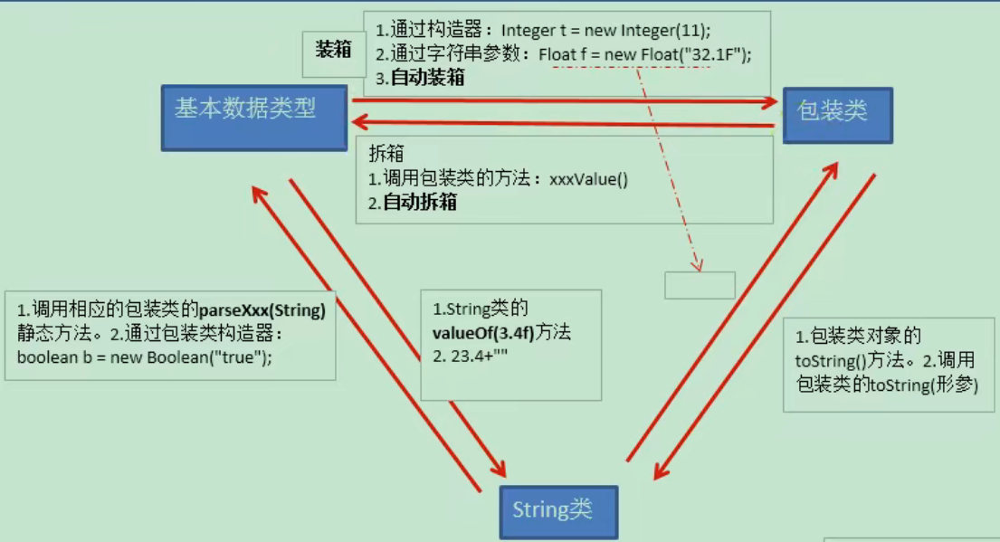

# Day 13

[toc]

## 一、多态性（Polymorphism）

### 1. 理解：对象的多态性，即   一个事物的多种形态

### 2. 何为多态性：

      子类对象的多态性：父类的引用指向子类的对象（子类的对象赋给父类的引用）

### 3. 多态的使用：虚拟方法调用

有了对象的多态性后，编译时，只能调用父类中声明的方法，实际运行时，执行的时子类中重写的父类的方法。

**总结：编译看左，执行看右。**

### 4. 多态性的使用前提：
      a. 类的继承关系

      b. 子类中要有方法的重写

### 5. 多态性的使用：见PolymorphismTest2.java

### 6. 对象的多态性，只适用于方法，不适用于属性（因为属性不能重写）

* <font color=green>**对于方法：** </font>若子类重写了父类的方法，就意味着子类里定义的方法彻底覆盖了父类里的同名方法，系统将不可能把父类里的方法转移到子类中。

  * <font color=red>编译看左边，运行看右边。</font>
  

* <font color=green>**对于属性：** </font>属性看左边，方法看右边。因此，<font color=red>子父类中尽量不要定义重名的属性。</font>

  * <font color=red>编译运行都看左边。</font> 

### 7. 虚拟方法调用（多态情况下）

      子类中定义了与父类同名同参数的方法，再多态情况下，将父类的方法成为虚拟方法，父类根据赋给它的不同子类对象，动态调用属于子类的该方法。

      这样的方法调用在编译期是无法确定的，实在运行时确定的，成为”动态绑定”或者“晚绑定”。

### 8. 不能调用子类所特有的方法、属性，因为编译时，p2时Person类型
    
    有了对象的多态性以后，内存中实际上已经加载了子类特有的属性和方法，但是由于变量声明为父类类型，
    导致编译时,只能调用父类中声明的属性和方法。子类特有的属性和方法不能调用。

## 二、instanceof 关键字

### 1. 如何才能调用子类特有的属性和方法？

向下转型--->使用强制类型转换符

### 2. instanceof关键字的使用

    a instanceof A: 判断对象a是否是类A的实例。如果是，返回true；如果不是，返回false。

**使用情境：** 为了避免在向下转型时出现**ClassCastException**的异常，我们在向下转型之前，先进行instanceof的判断，返回true，就向下转型。返回false，就中止向下转型。

### 3. 常见问题

* (1) 编译时通过，运行时不通过

**例一：m3实例化(new)为Woman()类对象，但Woman()不是Man()及其子类，不具有Man()类特有的属性，不能强转为Man()类**

```java
Person p3 = new Woman();
Man m3 = (Man)p3;
```

**例二：p4实例化(new)为Person()类对象，但Person()不是Man()及其子类，不具有Man()的特有属性，不能强转。**

```java
Person p4 = new Person();
Man m4 = (Man)p4;
```
* (2) 编译不通过

**Woman()类不是Man()类或其子类，不能赋(new)**

```java
Man m5 = new Woman();
```

* (3) 编译、运行都通过

**obj实例化(new)为Woman()类对象，指向了Object，且Woman()是Person()的子类，具有Person()类特有的属性，可以强转为Person()类**

```java
Object obj = new Woman();
Person p = (Person)obj;
```

## 三、Object类的使用(java.lang.Object)

* Object类是所有Java类的根父类


* 如果在类的声明中未使用extends关键字指明其父类，则默认父类为java.lang.Object类。


* Object类中的功能（属性、方法）就具有通用性


* Object类中只声明了<font color=red>**一个空参构造器**</font>

### 1. Object类中的功能（属性、方法）

* clone() —— 克隆对象
  * 相当于多态赋值，返回一个当前对象的复制，指向Object类。
  * 克隆后的对象指向Object，因此要再赋值给其他对象时，<font color=red>**需要强转**</font>。

```java
Person p1 = new Person;
Person p2 = (Person) p1.clone();
```

* public boolean equals() —— 比较两个对象是否相等


* finalize() —— 垃圾回收

  * 如果在堆空间中的对象没有任何栈空间中的引用指向它，则自动调用finalize()方法，自动回收堆空间中的空间。

    * `p = null` 此时对象实体就是垃圾对象，等待被回收但时间不确定
  
  * `System.gc()` 强制性释放空间。

* getClass() —— 获取当前对象所属的类

* hashCode() —— 返回当前对象的哈希值

* toString() —— 

  * 当输出一个对象的引用时，实际上就是调用当前对象的toString()方法

  * 像String、Date、File、包装类等都重写了Object类中的toString()方法，使得在调用对象的toString()时，返回”实体内容”信息。
  
  * 

  * Object类中toString()的定义

```java
public String toString(){
    return getClass().getName() + "@" = Interger.toHexString(hasCode());
        }
```

* notify() ——

* notifyAll() —— 

* wait() —— 

### 2. 问题：== 和 equals()的区别

#### 一、 == [运算符] 的使用

* 可以使用在基本数据类型和引用数据类型变量中

* **基本数据类型：** 比较两个变量保存的数据是否相等。(不一定要同类型)

* **引用数据类型：** 比较两个对象的地址值是否相同，即两个引用是否指向同一个对象实体。

#### 二、equals() [方法] 的使用

* 只能适用于引用数据类型

* Object类中equals()的定义，也是比较两个引用数据类型的地址值。

```java
public boolean equals(Object obj){
    return (this == obj);
}
```

* **String、Date、File、包装类**等都重写了Object类中的equals()方法。重写后，比较的不是两个引用的地址，而是**两个对象的“实体内容“是否相同**。

#### 三、自定义类重写equals()方法

* 自定义类如果使用equals()的话，也通常是比较两个对象”实体内容“是否相同，即需要对Object类中的equals()进行重写。

```java
@override
public boolean equals(Object obj){
    if(this == obj){
        return true;
        }
    if(obj instance of Customer){
        Customer cust = (Customer) obj;
        // 比较两个对象的每个属性是否都相同
        return (this.age == cust.age && this.name.equals(cust.name));
        }
    return false;
}
```

## 四、Java中的JUnit单元测试
  
* Java类的要求

  * 此类时public的

  * 此类提供公共的无参构造器


* 在此类中声明单元测试方法

  * 方法权限时public

  * 没有返回值

  * 没有形参

  * 此单元测试方法上，需要声明注解：@Test，然后“Alt + Enter”，加载JUnit;

  * 声明好单元测试方法以后，就可以在方法体内测试相关的代码。

  * 写完后，右键方法名，选择 Run ‘方法名()’。


## 五、包装类(Wrapper)的使用

    针对八种基本数据类型，定义相应的引用类型——包装类(封装类)。
    
    有了类的特点，才可以调用类中的方法，即面向对象。

| 基本数据类型  |                        包装类                        |
|:-------:|:-------------------------------------------------:|
|  byte   |                       Byte                        |
|  short  |                       Short                       |
|   int   |          <font color=red>Integer</font>           |
|  long   |                       Long                        |
|  float  |                       Float                       |
| double  |                      Double                       |
| boolean |                      Boolean                      |
|  char   |                     <font color=red>Character</font>                     |

    * 红色包装类为基本数据类型的全称。
    * 数值型包装类（前6种），有共同的父类Number。



### 1. 基本数据类型 ——> 包装类 


