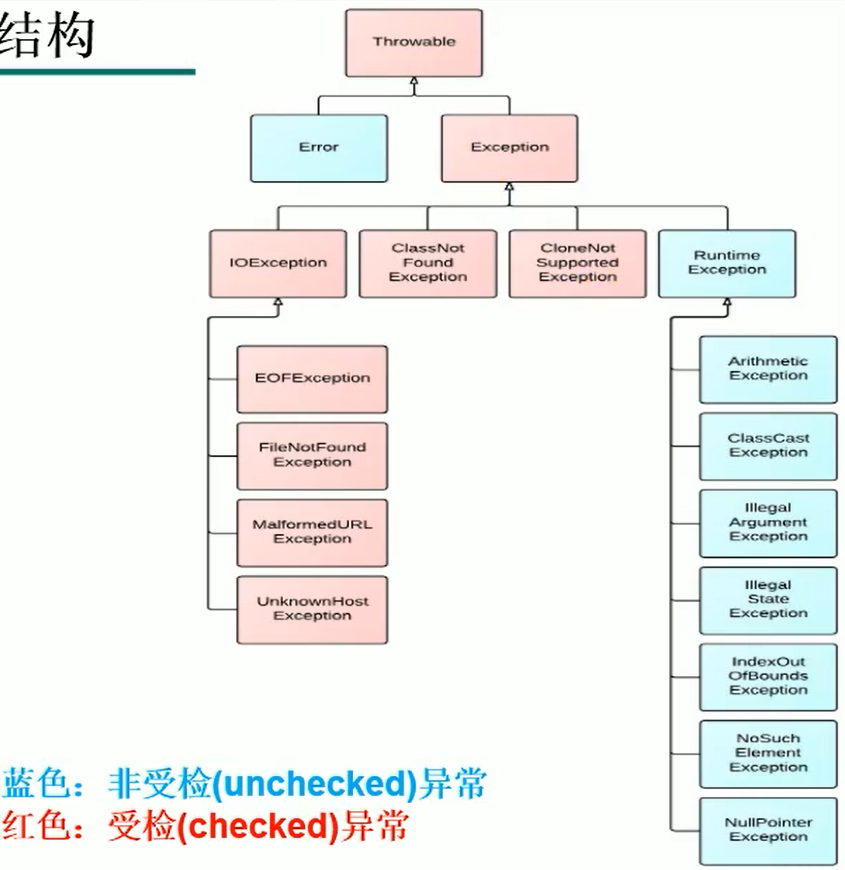

# 异常(Exception)

## 一、Throwable的分类: java.lang.Throwable

### 1. Error(错误): java.lang.Error

    Java虚拟机无法解决的严重问题。 ——> 一般不编写针对性的代码进行处理。

### 2. Exception(异常): java.lang.Exception

    其他因编程错误或偶然的外在因素导致的一般性问题。 ——> 可以使用针对性代码进行处理。

* 解决方法

  * 遇到错误就终止程序。
  * 由程序员在编写程序时，就考虑到错误的检测、错误消息的提示，以及错误的处理。


* 异常分类

  * 编译时异常
    * IOException
      * FileNotFoundException
    * ClassNotFoundException
  * 运行时异常 (RunTimeException)
    * 空指针异常：NullPointerException
    * 数组角标越界异常：ArrayIndexOutOfBoundsException
    * 类型转换异常：ClassCastException
    * 数值类型异常：NumberFormatException
    * 输入不匹配异常：InputMismatchException
    * 算数异常：ArithmeticException


## 二、异常处理

### 0. 抓抛模型

* 过程一：”抛“：程序在正常执行的过程中，一旦出现异常，就会在异常代码处生成一个对应异常类的对象，并将此对象抛出。一旦对象抛出后，其后的代码就不再执行。

* 过程二（抓）：可以理解为异常处理的方式
  * try-catch-finally
  * throws


### 1. 机制一：try-catch-finally

#### 1.1 代码结构

```java
try{
    //可能出现异常的代码
        }catch(异常类型1 变量名1){
        // 处理异常的方式1
        }catch(异常类型2 变量名2){
        // 处理异常的方式2
        }catch(异常类型3 变量名3){
        // 处理异常的方式3
        }
        ...
    finally{
        //一定会执行的代码
        }
```

* finally是可选的
* 使用try将可能出现异常的代码包装起来，在执行过程中，一旦出现异常，就会生成一个对应异常类的对象，根据此对象的类型，去catch中进行匹配。
* 一旦try中的异常对象匹配到某一catch时，就进入catch中进行异常处理。一旦处理完成就跳出当前的try-catch结构，继续执行其后的代码。
* catch中的异常类型如果满足子父类的关系，则要求子类必须声明在前。
* 常用的异常对象处理方式
  * `String getMessage()`
  * `printStackTrace()` ——> 更常用
* try-catch-finally也可以嵌套

#### 1.2 try-catch-finally中final的使用

* finally是可选的
* finally中声明的是一定会被执行的代码。即使catch中又出现异常、try中由return语句、catch中有return语句等情况。
* 像数据库连接、输入输出流、网络编程Socket等资源，JVM是不能自动回收的，我们需要自己手动地进行资源的释放。此时的资源释放，就需要声明在finally中。

#### 1.3 总结

* try-catch-finally处理编译时异常，使得编译不报错，但运行时仍有可能报错。即将编译时可能出现的异常，延迟到运行时再出现。
* 开发中，由于运行时异常比较常见，通常只针对编译时异常考虑try-catch-finally异常处理。

### 2. 机制一：throws + 异常类型

```java
public void method() throws FileNotFoundException, IOException{
    //可能出现异常的方法体
        }
```

* 声明再方法的声明处，知名此方法执行时可能会出现的异常。一旦方法执行时出现异常，仍会在代码处生成一个异常的对象，此对象满足throws声明时的异常类型时，就会被抛出。其后的代码不再执行。
* try-catch-finally：真正的将异常处理掉了
* throws：只是将异常抛给了方法的调用者，异常并没有被处理掉。

## 三、重写异常抛出的规则

